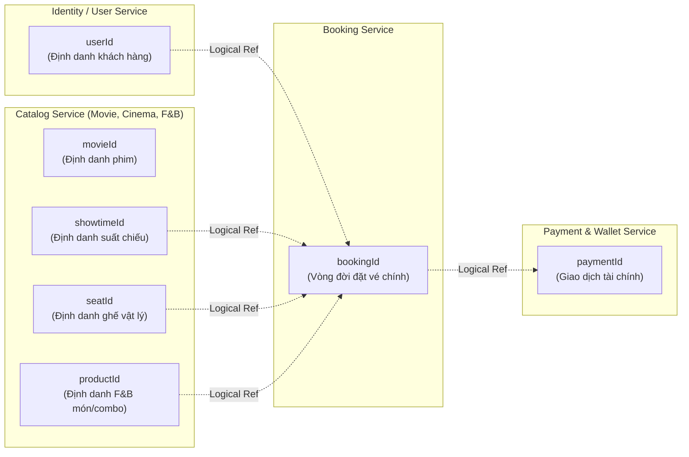
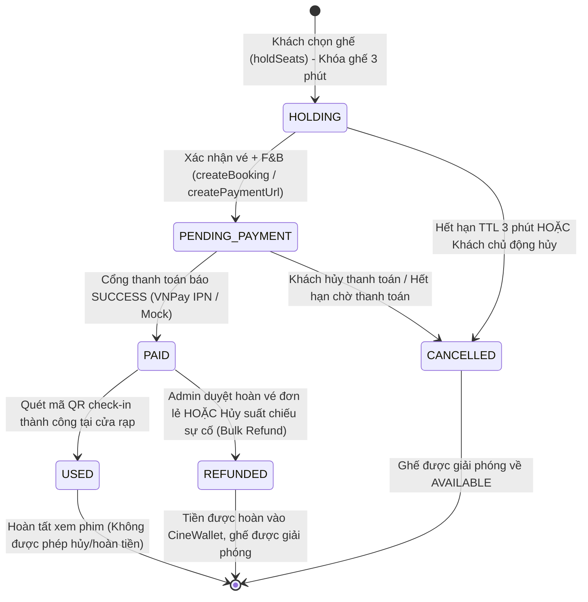
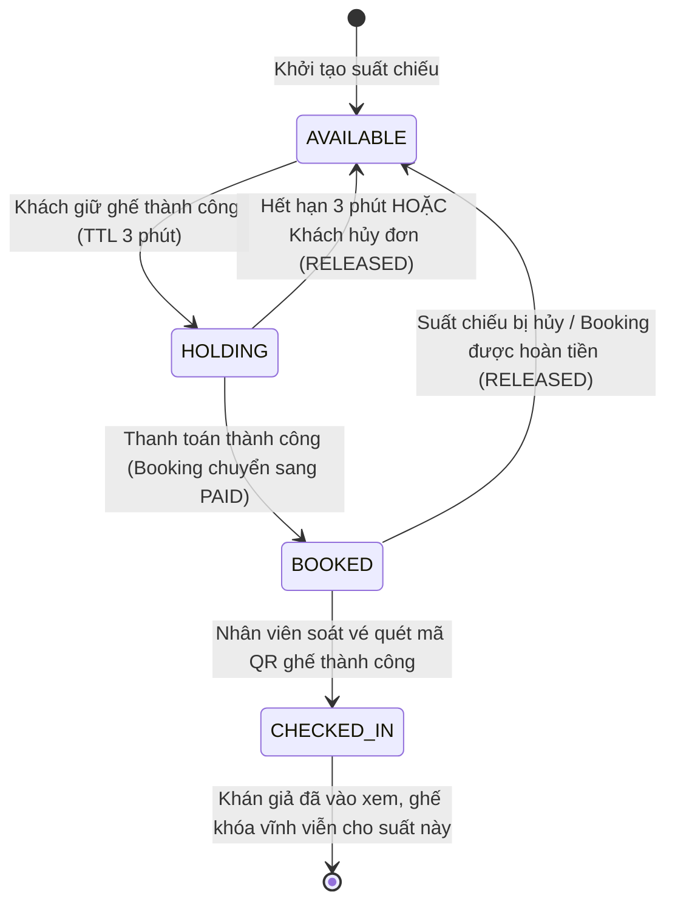
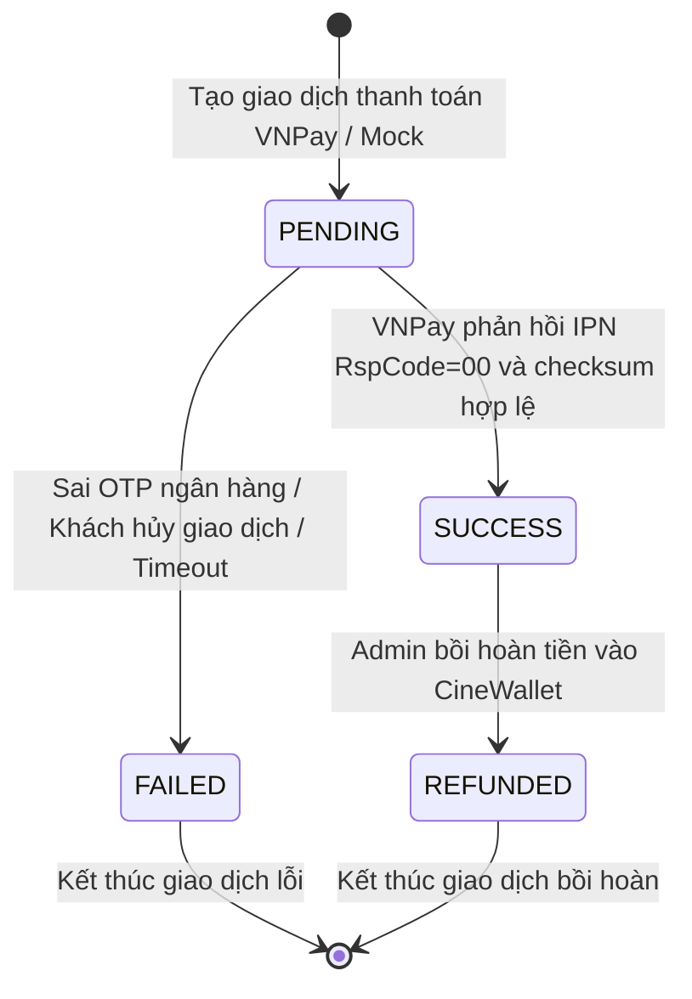
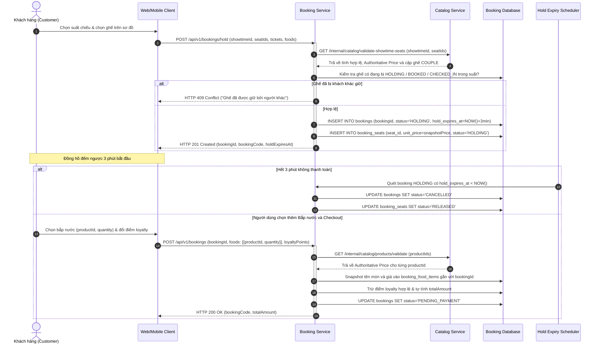
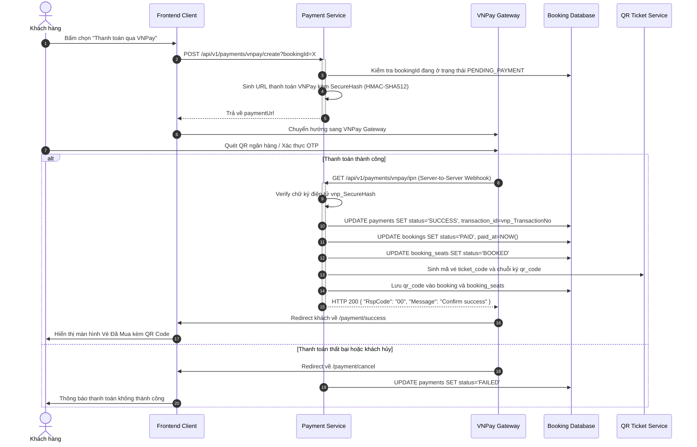
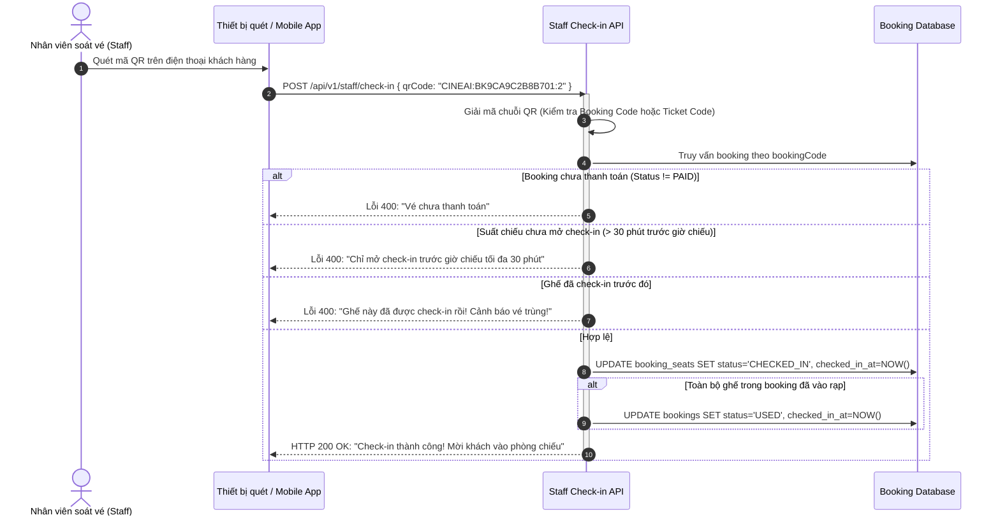
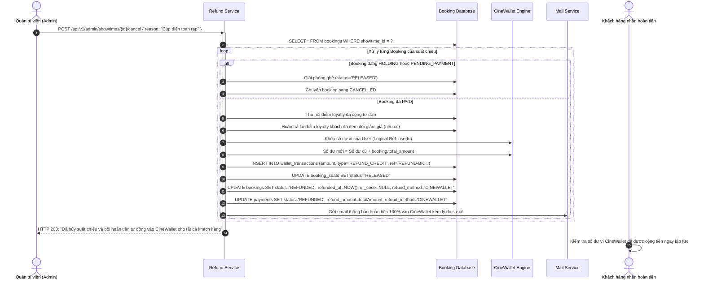

# CONCEPTUAL MODEL: BOOKING & PAYMENT DOMAIN (PERSON 3)
**Hệ thống:** CinemaAI / CinePremier  
**Phân công thực hiện:** Khang
**Phạm vi nghiệp vụ:** Đặt vé (Booking), Giữ ghế (Seat Locking), Bắp nước đi kèm (F&B Concessions), Thanh toán (Payment), Hoàn tiền (Refund), và Cơ chế Snapshot dữ liệu lịch sử (Data Snapshot & Immutability).

---

## 1. TỔNG QUAN VÀ MỤC TIÊU THIẾT KẾ

Phân hệ **Booking & Payment** là trái tim giao dịch của nền tảng rạp chiếu phim CinemaAI. Module này chịu trách nhiệm quản lý vòng đời đơn đặt vé từ lúc khách hàng bắt đầu chọn ghế, áp dụng chính sách giá, chọn bắp nước, thanh toán qua cổng điện tử, nhận vé điện tử QR, vào rạp xem phim cho đến các tình huống hủy vé, hoàn tiền sự cố vận hành.

### Các mục tiêu cốt lõi:
1. **Kiến trúc Bounded Context & Chuẩn hóa 7 Logical ID:** Phân định ranh giới độc lập giữa các service thông qua đúng 7 định danh logic. Tuyệt đối không tạo ràng buộc khóa ngoại (Foreign Key) ở tầng cơ sở dữ liệu xuyên service, sẵn sàng cho kiến trúc Microservice.
2. **Quyền lực Giá thuộc về Catalog & Snapshot bất biến tại Booking:** Client chỉ gửi ID và số lượng (ngăn chặn 100% Price Tampering). Booking Service gọi Catalog để lấy giá có thẩm quyền (Authoritative Price) và tự tính toán, đóng băng dữ liệu Snapshot lịch sử.
3. **Toàn vẹn ghế (Zero Double-Booking):** Đảm bảo tại một thời điểm, một ghế vật lý trong một suất chiếu chỉ có tối đa một khách hàng giữ hoặc mua thành công thông qua cơ chế khóa ghế có thời hạn (TTL 3 phút) và kiểm soát tương tranh.
4. **Đơn nhất định danh (bookingId xuyên suốt):** Sử dụng duy nhất `bookingId` từ lúc giữ ghế, thanh toán đến khi sinh QR check-in, không sinh thêm thực thể trung gian như `checkoutId` hay `orderId`.
5. **Phân định ranh giới vé và F&B độc lập:** Khách mua vé (kèm bắp nước hoặc không) quản lý qua `bookingId`. Thực thể `foodOrderId` chỉ dùng cho khách mua bắp nước riêng lẻ.
6. **Quy trình hoàn tiền tự động vào CineWallet:** Hoàn tiền 100% vào ví điện tử khi hủy suất chiếu sự cố (Bulk Refund) hoặc admin duyệt hoàn vé lẻ, tự động thu hồi/khôi phục điểm tích lũy (Loyalty Points).

---

## 2. BỘ 7 LOGICAL ID CHUẨN HÓA VÀ RANH GIỚI BOUNDED CONTEXT

Hệ thống CinemaAI phân định ranh giới sở hữu (Domain Ownership) và giao tiếp độc lập thông qua đúng **7 định danh logic**:



### Chi tiết 7 Logical ID:
1. **`userId` (Identity Service):** Định danh duy nhất của khách hàng thực hiện giao dịch đặt vé, tích điểm hoặc nhận tiền hoàn ví.
2. **`movieId` (Catalog Service):** Định danh tác phẩm điện ảnh, poster và thông tin phân loại độ tuổi.
3. **`showtimeId` (Catalog Service):** Định danh lịch chiếu cụ thể gắn với phòng và khung giờ chiếu.
4. **`seatId` (Catalog Service):** Định danh vị trí ghế vật lý trên sơ đồ phòng chiếu (vị trí tọa độ, loại ghế STANDARD/VIP/COUPLE).
5. **`productId` (Catalog Service):** Định danh thống nhất cho mọi mặt hàng bắp nước F&B (bao gồm cả món ăn lẻ `FoodItem` và phần combo `FoodCombo`). Catalog Service chịu trách nhiệm quản lý cấu trúc sản phẩm.
6. **`bookingId` (Booking Service):** Mã định danh nghiệp vụ chính xuyên suốt toàn bộ vòng đời đặt vé (từ lúc giữ ghế 3 phút, checkout, thanh toán cho đến khi sinh mã QR check-in). Không sinh thêm các thực thể trung gian như `checkoutId` hay `orderId` nhằm giữ kiến trúc tinh gọn.
7. **`paymentId` (Payment Service):** Định danh giao dịch thanh toán tài chính (liên kết logic với `bookingId` hoặc `foodOrderId`).

### Nguyên tắc "Không khóa ngoại liên Database" (No Cross-Database Foreign Keys):
- Toàn bộ các định danh `userId`, `movieId`, `showtimeId`, `seatId`, `productId` khi lưu tại Booking Service chỉ là trường số nguyên (`BIGINT`) đóng vai trò **tham chiếu logic (Soft Reference)**.
- **Không có ràng buộc `FOREIGN KEY ... REFERENCES` ở tầng Database** giữa các service.
- **Lợi ích kiến trúc:** Đảm bảo tính đóng gói (Bounded Context), độc lập mở rộng và sẵn sàng tách thành các microservice riêng biệt mà không bị dính chặt (tight-coupling) cơ sở dữ liệu. Tính toàn vẹn dữ liệu được đảm bảo thông qua API Validation Contract tại thời điểm tạo đơn.

### Phân định phạm vi giữa `bookingId` và `foodOrderId`:
- **Khách mua vé xem phim:** Dù có mua kèm bắp nước hay không đều quy về một thực thể duy nhất quản lý bởi `bookingId`. Các món bắp nước mua kèm vé được lưu thành các dòng chi tiết `BookingFoodItem` gắn trực tiếp với `bookingId`.
- **`foodOrderId` độc lập:** Chỉ được khởi tạo khi có nghiệp vụ mua đồ ăn riêng lẻ (khách vãng lai mua F&B tại quầy concession hoặc khách đặt thêm bắp nước online bổ sung sau khi vé đã thanh toán). Hai luồng này hoàn toàn tách biệt, không dùng chung thực thể.

---

## 3. CONCEPTUAL ERD: DOMAIN BOOKING & PAYMENT

Sơ đồ quan hệ thực thể thể hiện rõ các thực thể nội bộ của Booking & Payment và các tham chiếu logic tới các Service khác:

```mermaid
erDiagram
    %% Các thực thể nội bộ của Booking Service
    BOOKING ||--o{ BOOKING_SEAT : "quản lý ghế giữ/đặt"
    BOOKING ||--o{ BOOKING_TICKET : "quản lý phân loại vé"
    BOOKING ||--o{ BOOKING_FOOD_ITEM : "quản lý F&B mua kèm"
    
    %% Liên kết sang Payment & Wallet
    BOOKING ||--o{ PAYMENT : "liên kết thanh toán logic (bookingId)"
    BOOKING ||--o{ WALLET_TRANSACTION : "liên kết hoàn tiền logic (bookingId)"
    
    CINE_WALLET ||--o{ WALLET_TRANSACTION : "ghi biến động số dư"

    BOOKING {
        bigint id PK "bookingId: Định danh chính xuyên suốt vòng đời"
        string booking_code UK "Mã đặt vé hiển thị (BK...)"
        bigint user_id "Logical Ref: userId (Identity)"
        bigint showtime_id "Logical Ref: showtimeId (Catalog)"
        decimal subtotal "SNAPSHOT: Tổng tiền gốc trước chiết khấu"
        decimal discount_amount "SNAPSHOT: Số tiền chiết khấu điểm Loyalty"
        int loyalty_points_redeemed "SNAPSHOT: Số điểm tích lũy đã trừ"
        decimal total_amount "SNAPSHOT: Số tiền thực tế phải thanh toán"
        string status "HOLDING | PENDING_PAYMENT | PAID | USED | CANCELLED | REFUNDED"
        datetime hold_expires_at "Thời điểm hết hạn giữ ghế (TTL 3 phút)"
        datetime paid_at "Thời điểm thanh toán thành công"
        datetime checked_in_at "Thời điểm quét QR vào rạp"
        datetime cancelled_at "Thời điểm đơn bị hủy"
        datetime refunded_at "Thời điểm hoàn tất hoàn tiền"
        string refund_reason "Lý do hoàn/hủy đơn"
        string refund_method "Phương thức hoàn tiền (CINEWALLET)"
        boolean bulk_refund "Cờ đánh dấu hoàn tiền sự cố hủy suất"
        string qr_code "Mã QR đại diện cho toàn bộ đơn vé"
        datetime created_at "Thời điểm tạo đơn"
    }

    BOOKING_SEAT {
        bigint id PK
        bigint booking_id FK "Liên kết bookingId cha"
        bigint showtime_id "Logical Ref: showtimeId"
        bigint seat_id "Logical Ref: seatId (Catalog)"
        string row_label "SNAPSHOT: Nhãn hàng ghế (A, B, C...)"
        int seat_number "SNAPSHOT: Số ghế hiển thị (1, 2, 3...)"
        string seat_type "SNAPSHOT: Loại ghế (STANDARD, VIP, COUPLE)"
        decimal unit_price "SNAPSHOT: Đơn giá ghế tại thời điểm giữ chỗ"
        string status "HOLDING | BOOKED | CHECKED_IN | RELEASED"
        string ticket_code UK "Mã vé từng ghế (BK...-ROW-NUM)"
        string qr_code "Mã QR riêng cho từng ghế"
        string ticket_type "ADULT | STUDENT | CHILD | SENIOR"
        datetime checked_in_at "Thời điểm ghế này vào phòng chiếu"
    }

    BOOKING_TICKET {
        bigint id PK
        bigint booking_id FK "Liên kết bookingId cha"
        string ticket_type "ADULT | STUDENT | CHILD | SENIOR"
        int viewer_age "SNAPSHOT: Độ tuổi khán giả khai báo"
        int quantity "Số lượng vé theo phân loại"
        decimal unit_price "SNAPSHOT: Đơn giá thẩm quyền từ Catalog"
        decimal line_total "SNAPSHOT: Thành tiền dòng vé (quantity * unit_price)"
    }

    BOOKING_FOOD_ITEM {
        bigint id PK
        bigint booking_id FK "Liên kết bookingId cha (F&B mua kèm vé)"
        bigint product_id "Logical Ref: productId (Catalog F&B item/combo)"
        string product_name "SNAPSHOT: Tên món/combo tại thời điểm mua"
        int quantity "Số lượng phần ăn"
        decimal unit_price "SNAPSHOT: Đơn giá thẩm quyền từ Catalog"
        decimal line_total "SNAPSHOT: Thành tiền dòng F&B (quantity * unit_price)"
    }

    PAYMENT {
        bigint id PK "paymentId: Định danh giao dịch tài chính"
        bigint booking_id "Logical Ref: bookingId (NULL nếu là foodOrderId)"
        bigint food_order_id "Logical Ref: foodOrderId (NULL nếu là booking vé)"
        string provider "VNPAY | MOCK | CINEWALLET"
        string transaction_id "Mã đối soát giao dịch từ cổng thanh toán"
        decimal amount "Số tiền thanh toán thực tế"
        string status "PENDING | SUCCESS | FAILED | REFUNDED"
        datetime paid_at "Thời điểm cổng thanh toán xác nhận thành công"
        string payment_account_label "Thông tin che giấu tài khoản (VD: VNPAY ****1234)"
        string callback_payload "Dữ liệu đối soát IPN/Webhook từ VNPay"
        decimal refund_amount "Số tiền hoàn thực tế"
        datetime refunded_at "Thời điểm giao dịch hoàn tiền hoàn tất"
        string refund_transaction_no "Mã tham chiếu đối soát hoàn tiền"
        string refund_method "Phương thức hoàn (CINEWALLET)"
    }

    CINE_WALLET {
        bigint id PK
        bigint user_id "Logical Ref: userId (Chủ sở hữu ví)"
        decimal balance "Số dư khả dụng trong ví"
    }

    WALLET_TRANSACTION {
        bigint id PK
        bigint wallet_id FK "Thuộc ví nào"
        bigint user_id "Logical Ref: userId"
        bigint booking_id "Logical Ref: bookingId (nếu phát sinh từ hoàn vé)"
        string type "REFUND_CREDIT | BOOKING_DEBIT | TOP_UP | WITHDRAWAL"
        decimal amount "Số tiền biến động"
        decimal balance_after "Số dư ví sau biến động"
        string reference_code "Mã tham chiếu giao dịch (REFUND-BK...)"
        string description "Mô tả lý do biến động"
    }
```



---

## 4. NGUYÊN TẮC "QUYỀN LỰC GIÁ THUỘC VỀ CATALOG" & "SNAPSHOT TẠI BOOKING"

### 4.1. Ngăn chặn triệt để lỗ hổng giả mạo giá (Zero-Trust Anti Price Tampering)
- **Quy tắc bất di bất dịch:** Phía Client (Web React / Mobile App) **chỉ được phép gửi ID và Số lượng**:
  ```json
  {
    "showtimeId": 105,
    "seatIds": [12, 13],
    "tickets": [
      { "seatId": 12, "ticketType": "ADULT", "viewerAge": 24, "quantity": 1 },
      { "seatId": 13, "ticketType": "STUDENT", "viewerAge": 20, "quantity": 1 }
    ],
    "foods": [
      { "productId": 501, "quantity": 2 }
    ]
  }
  ```
- Phía Client **tuyệt đối không gửi giá tiền (`price`) hoặc tổng tiền (`totalAmount`)** làm dữ liệu tin cậy. Nếu Client có gửi kèm các trường này trong payload, Backend lập tức bỏ qua hoặc từ chối xử lý.
- Khi nhận yêu cầu, Booking Service gửi request sang Catalog Service để kiểm tra tính hợp lệ và nhận về **Giá có thẩm quyền (Authoritative Price)** cùng dữ liệu hiển thị.
- Booking Service tự thực hiện công thức tính toán:
  $$\text{Subtotal} = \sum (\text{AuthoritativeTicketPrice} \times \text{Qty}) + \sum (\text{AuthoritativeProductPrice} \times \text{Qty})$$
  $$\text{TotalAmount} = \max(0, \text{Subtotal} - \text{ValidatedLoyaltyDiscount})$$

### 4.2. Bảng đối chiếu trường dữ liệu Live vs. Dữ liệu Snapshot

| Thành phần | Nguồn Live (Catalog / User Service) | Dữ liệu Snapshot bất biến (Booking Service) | Lý do bảo toàn nghiệp vụ |
|---|---|---|---|
| **Tên phim & Poster** | `movieId` $\rightarrow$ `Movie.title`, `posterUrl` | Lưu snapshot tên phim, poster vào chi tiết đơn vé | Tránh tranh chấp khi phim sửa tựa đề Việt hóa hoặc đổi poster sau này. |
| **Phòng & Rạp** | `showtimeId` $\rightarrow$ `Cinema.name`, `Room.name` | Lưu cố định tên rạp, tên phòng tại thời điểm chiếu | Bằng chứng đối soát vị trí chiếu, tránh việc đổi tên phòng làm sai vé cũ. |
| **Thời gian chiếu** | `showtimeId` $\rightarrow$ `startTime`, `endTime` | Snapshot thời gian bắt đầu và kết thúc | Cơ sở xác định điều kiện mở check-in (trước 30 phút) và giải quyết hoàn tiền. |
| **Nhãn & Số ghế** | `seatId` $\rightarrow$ `rowLabel`, `seatNumber`, `seatType` | `BookingSeat.row_label`, `seat_number`, `seat_type` | Đảm bảo dù phòng chiếu được cấu hình lại ghế sau này, cuống vé của khách vẫn đúng vị trí ghế thực tế đã ngồi. |
| **Đơn giá vé** | `Catalog.TicketPricingRule` | `BookingTicket.unit_price`, `BookingSeat.unit_price` | **Bắt buộc Snapshot:** Đóng băng đơn giá vé đã bán, ngăn việc tăng giá vé sau này làm sai lệch doanh thu quá khứ. |
| **Độ tuổi người xem**| Tuổi khai báo lúc đặt | `BookingTicket.viewer_age` | Ghi nhận bằng chứng đã xác thực tuổi khán giả phù hợp với Age Rating của phim (P, T13, T16, T18). |
| **Bắp nước F&B** | `productId` $\rightarrow$ `Catalog.Product` | `BookingFoodItem.product_name`, `unit_price` | **Bắt buộc Snapshot:** Đóng băng tên món ăn và đơn giá bắp nước tại thời điểm mua. |
| **Tổng tiền thanh toán**| Tính toán thời gian thực | `Booking.subtotal`, `Booking.total_amount` | Giá trị bất biến phục vụ kế toán, thuế và đối soát giao dịch cổng thanh toán VNPay IPN. |

---

## 5. VÒNG ĐỜI VÀ MÁY TRẠNG THÁI (STATE MACHINES)

### 5.1. Máy trạng thái Đơn đặt vé (Booking Status)
Đơn vé được quản lý duy nhất bằng `bookingId` xuyên suốt toàn bộ vòng đời:



### 5.2. Máy trạng thái Ghế theo Suất chiếu (Seat Runtime Status)



### 5.3. Máy trạng thái Giao dịch Thanh toán (Payment Status)



---

## 6. QUY TRÌNH NGHIỆP VỤ END-TO-END (BUSINESS WORKFLOWS)

### 6.1. Luồng Giữ ghế và Đặt vé kèm Bắp nước (Seat Locking & Booking Flow)



### 6.2. Luồng Thanh toán VNPay & Mock Payment (Payment Processing Flow)



### 6.3. Luồng Quét QR Soát vé vào rạp (Staff QR Check-in Flow)



### 6.4. Luồng Hoàn tiền Tự động vào CineWallet khi Hủy suất chiếu sự cố (Bulk Refund)



---

## 7. TỪ ĐIỂN DỮ LIỆU CHI TIẾT (DATA DICTIONARY)

### Bảng: `bookings`
| Tên cột | Kiểu dữ liệu | Nullable | Mô tả nghiệp vụ |
|---|---|---|---|
| `id` | BIGINT (PK) | NO | **`bookingId`**: Khóa chính định danh duy nhất xuyên suốt toàn bộ vòng đời đặt vé |
| `booking_code` | VARCHAR(50) | NO | Mã đặt vé hiển thị người dùng (VD: `BK8A7B2C10D`) |
| `user_id` | BIGINT | NO | **Logical Ref (`userId`)**: Khách hàng đặt vé (Không tạo DB FK) |
| `showtime_id` | BIGINT | NO | **Logical Ref (`showtimeId`)**: Suất chiếu được chọn (Không tạo DB FK) |
| `subtotal` | DECIMAL(12,2)| NO | **Snapshot:** Tổng tiền vé + bắp nước tính từ Authoritative Price của Catalog |
| `discount_amount`| DECIMAL(12,2)| NO | **Snapshot:** Số tiền chiết khấu từ điểm Loyalty |
| `loyalty_points_redeemed`| INT | NO | **Snapshot:** Số điểm tích lũy đã trừ cho đơn này |
| `total_amount` | DECIMAL(12,2)| NO | **Snapshot:** Số tiền thanh toán cuối cùng khách phải trả |
| `status` | VARCHAR(30) | NO | Trạng thái: `HOLDING`, `PENDING_PAYMENT`, `PAID`, `USED`, `CANCELLED`, `REFUNDED` |
| `hold_expires_at`| DATETIME | YES | Mốc thời gian hết hạn giữ chỗ (3 phút kể từ lúc hold) |
| `paid_at` | DATETIME | YES | Mốc thời gian thanh toán thành công |
| `checked_in_at` | DATETIME | YES | Mốc thời gian toàn bộ vé trong booking đã vào rạp |
| `cancelled_at` | DATETIME | YES | Mốc thời gian đơn bị hủy |
| `refunded_at` | DATETIME | YES | Mốc thời gian hoàn tất bồi hoàn tiền |
| `refund_reason`| VARCHAR(500)| YES | Lý do hoàn hủy đơn (sự cố kỹ thuật, cúp điện, yêu cầu hợp lệ) |
| `refund_method`| VARCHAR(50) | YES | Kênh hoàn tiền: `CINEWALLET` |
| `bulk_refund` | BOOLEAN | NO | Đánh dấu đơn hoàn nằm trong đợt hủy suất hàng loạt |
| `qr_code` | VARCHAR(500)| YES | Chuỗi định danh sinh mã QR tổng hợp của đơn vé |

### Bảng: `booking_seats`
| Tên cột | Kiểu dữ liệu | Nullable | Mô tả nghiệp vụ |
|---|---|---|---|
| `id` | BIGINT (PK) | NO | Khóa chính tự tăng |
| `booking_id` | BIGINT (FK) | NO | Thuộc `bookingId` nào trong Booking Service |
| `showtime_id` | BIGINT | NO | **Logical Ref (`showtimeId`)**: Suất chiếu áp dụng |
| `seat_id` | BIGINT | NO | **Logical Ref (`seatId`)**: Ghế vật lý tương ứng trong phòng |
| `row_label` | VARCHAR(10) | NO | **Snapshot:** Nhãn hàng ghế (A, B, C...) tại thời điểm đặt |
| `seat_number` | INT | NO | **Snapshot:** Số ghế hiển thị (1, 2, 3...) tại thời điểm đặt |
| `seat_type` | VARCHAR(20) | NO | **Snapshot:** Loại ghế (`STANDARD`, `VIP`, `COUPLE`) |
| `unit_price` | DECIMAL(12,2)| NO | **Snapshot:** Đơn giá ghế có thẩm quyền từ Catalog tại thời điểm giữ chỗ |
| `status` | VARCHAR(30) | NO | `HOLDING`, `BOOKED`, `CHECKED_IN`, `RELEASED` |
| `ticket_code` | VARCHAR(60) | YES | Mã vé riêng biệt cho từng ghế (VD: `BK8A7B2C10D-G12`) |
| `qr_code` | VARCHAR(500)| YES | Mã QR riêng cho từng vé ghế phục vụ vào rạp lẻ |
| `ticket_type` | VARCHAR(30) | YES | Phân loại vé: `ADULT`, `STUDENT`, `CHILD`, `SENIOR` |
| `checked_in_at` | DATETIME | YES | Thời điểm ghế cụ thể này được quét QR soát vé |

### Bảng: `booking_tickets`
| Tên cột | Kiểu dữ liệu | Nullable | Mô tả nghiệp vụ |
|---|---|---|---|
| `id` | BIGINT (PK) | NO | Khóa chính tự tăng |
| `booking_id` | BIGINT (FK) | NO | Thuộc `bookingId` nào |
| `ticket_type` | VARCHAR(30) | NO | Phân loại loại vé theo đối tượng (`ADULT`, `STUDENT`, `CHILD`, `SENIOR`) |
| `viewer_age` | INT | NO | **Snapshot:** Tuổi người xem khai báo để kiểm tra độ tuổi |
| `quantity` | INT | NO | Số lượng vé theo phân loại này |
| `unit_price` | DECIMAL(12,2)| NO | **Snapshot:** Đơn giá có thẩm quyền từ Catalog sau khi tính theo quy tắc giá |
| `line_total` | DECIMAL(12,2)| NO | **Snapshot:** Tổng dòng tiền = `quantity * unit_price` |

### Bảng: `booking_food_items`
| Tên cột | Kiểu dữ liệu | Nullable | Mô tả nghiệp vụ |
|---|---|---|---|
| `id` | BIGINT (PK) | NO | Khóa chính tự tăng |
| `booking_id` | BIGINT (FK) | NO | Thuộc `bookingId` nào (F&B mua kèm vé xem phim) |
| `product_id` | BIGINT | NO | **Logical Ref (`productId`)**: Định danh sản phẩm F&B thống nhất trong Catalog |
| `product_name`| VARCHAR(150)| NO | **Snapshot:** Tên món ăn hoặc combo tại thời điểm đặt |
| `quantity` | INT | NO | Số lượng phần đặt mua |
| `unit_price` | DECIMAL(12,2)| NO | **Snapshot:** Đơn giá có thẩm quyền từ Catalog tại thời điểm đặt |
| `line_total` | DECIMAL(12,2)| NO | **Snapshot:** Thành tiền = `quantity * unit_price` |

### Bảng: `payments`
| Tên cột | Kiểu dữ liệu | Nullable | Mô tả nghiệp vụ |
|---|---|---|---|
| `id` | BIGINT (PK) | NO | **`paymentId`**: Khóa chính định danh giao dịch tài chính |
| `booking_id` | BIGINT | YES | **Logical Ref (`bookingId`)**: Đơn đặt vé cần thanh toán (NULL nếu mua F&B lẻ) |
| `food_order_id`| BIGINT | YES | **Logical Ref (`foodOrderId`)**: Đơn F&B độc lập cần thanh toán (NULL nếu là vé) |
| `provider` | VARCHAR(30) | NO | Cổng thanh toán: `VNPAY`, `MOCK`, `CINEWALLET` |
| `transaction_id`| VARCHAR(100)| YES | Mã giao dịch đối soát trả về từ VNPay / Bank |
| `amount` | DECIMAL(12,2)| NO | Số tiền thực tế giao dịch |
| `status` | VARCHAR(30) | NO | Trạng thái: `PENDING`, `SUCCESS`, `FAILED`, `REFUNDED` |
| `paid_at` | DATETIME | YES | Thời điểm cổng thanh toán xác nhận trừ tiền thành công |
| `refund_amount`| DECIMAL(12,2)| YES | Số tiền hoàn lại cho khách khi có sự cố |
| `refund_transaction_no`| VARCHAR(100)| YES | Mã giao dịch hoàn tiền để đối soát kế toán |

---
*Tài liệu đã cập nhật chuẩn hóa Bộ 7 Logical ID, xóa bỏ Foreign Key liên service và tuân thủ tuyệt đối nguyên tắc Quyền lực giá Catalog & Snapshot bất biến.*
