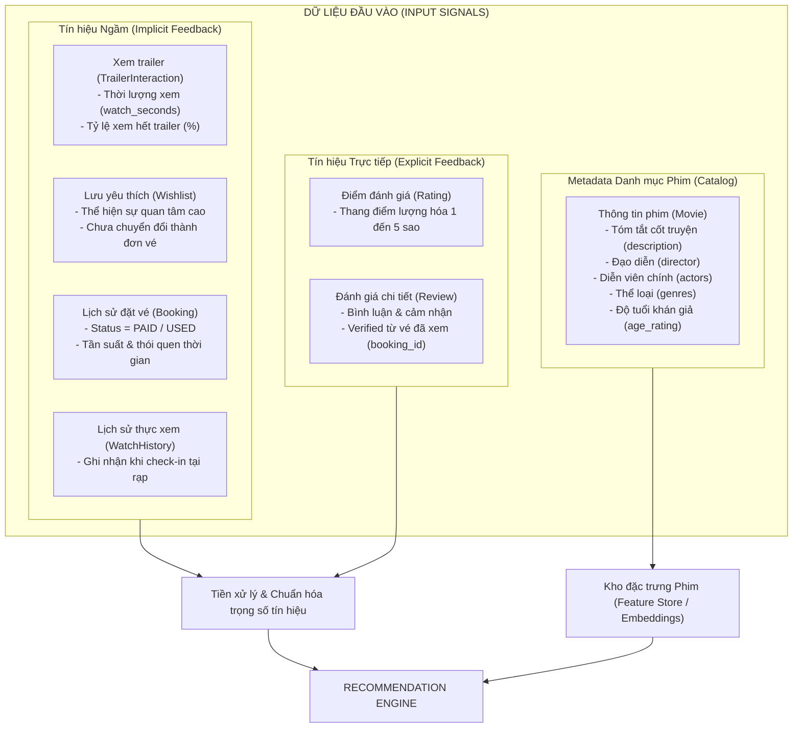
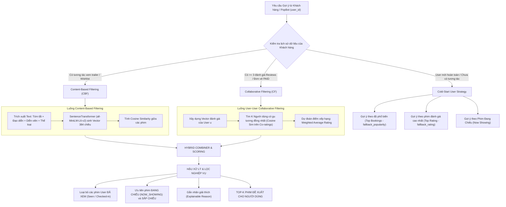

# CONCEPTUAL MODEL: RECOMMENDATION DOMAIN (PERSON 6)
**Hệ thống:** CinemaAI / CinePremier  
**Phân công thực hiện:** Người 6  
**Phạm vi nghiệp vụ:** Mô hình gợi ý phim thông minh (Movie Recommendation Engine), Thu thập dữ liệu hành vi (Input Data Signals), Lọc theo nội dung (Content-Based Filtering), Lọc cộng tác (Collaborative Filtering), Mô hình kết hợp (Hybrid Recommendation), Giải quyết bài toán khởi đầu lạnh (Cold-Start Solutions), và Khả năng giải thích gợi ý (Explainable AI).

---

## 1. TỔNG QUAN VÀ MỤC TIÊU HỆ THỐNG GỢI Ý

Trong nền tảng CinemaAI / CinePremier, hệ thống gợi ý (Recommendation Engine) đóng vai trò nâng cao trải nghiệm cá nhân hóa cho khán giả, tăng tỷ lệ đặt vé (Booking Conversion Rate), thúc đẩy doanh thu rạp và làm lõi tri thức cho trợ lý ảo PopBot (AI Chatbot tư vấn phim).

### Các mục tiêu cốt lõi:
1. **Đa dạng hóa tín hiệu đầu vào:** Không chỉ dựa vào lượt đánh giá chủ quan mà còn khai thác toàn diện hành vi thực tế như xem trailer, lưu danh sách yêu thích (wishlist), lịch sử mua vé và thời điểm thực sự vào rạp xem phim.
2. **Tiếp cận đa mô hình (Multi-strategy Recommendation):**
   - **Content-Based Filtering:** Khai thác độ tương đồng sâu về mặt nội dung (cốt truyện, thể loại, đạo diễn, diễn viên) thông qua mô hình nhúng ngữ nghĩa (Sentence Transformers).
   - **Collaborative Filtering:** Khai thác sự đồng điệu về "gu" xem phim giữa các nhóm khán giả (User-User K-NN).
   - **Hybrid Engine:** Phối hợp linh hoạt giữa các thuật toán để tận dụng thế mạnh và bù trừ khuyết điểm của từng phương pháp.
3. **Khắc phục triệt để bài toán Cold-Start:** Đảm bảo khán giả mới đăng ký hoặc bộ phim mới phát hành vẫn nhận được các đề xuất chính xác, phù hợp mà không bị hiện tượng "trống trang" hoặc gợi ý ngẫu nhiên.
4. **Minh bạch và có khả năng giải thích (Explainable Recommendations):** Mỗi bộ phim được gợi ý đều đi kèm lý do rõ ràng ("Vì bạn đã thích Inception", "8 khán giả có cùng gu đánh giá 4.8/5", "Phim cùng đạo diễn...") giúp người dùng tin tưởng và tăng khả năng ra quyết định đặt vé.

---

## 2. DỮ LIỆU ĐẦU VÀO VÀ TÍN HIỆU HÀNH VI (INPUT DATA SIGNALS)

Hệ thống Recommendation thu thập và phân loại dữ liệu đầu vào thành hai nhóm tín hiệu chính: **Tín hiệu ngầm (Implicit Feedback)** và **Tín hiệu trực tiếp (Explicit Feedback)**.

### 2.1. Phân tích chi tiết từng nguồn dữ liệu

| Nguồn dữ liệu | Thực thể liên kết | Phân loại | Trọng số tín hiệu | Ý nghĩa nghiệp vụ trong gợi ý |
|---|---|---|:---:|---|
| **Lịch sử thực xem** | `WatchHistory`, `Booking` (`status = USED`) | Implicit | **1.0 (Cao nhất)** | Xác nhận khán giả đã trực tiếp trải nghiệm bộ phim tại rạp. Dùng để làm điểm neo (anchor) phân tích gu và loại bỏ phim đã xem khỏi danh sách đề xuất. |
| **Đơn vé đã mua** | `Booking` (`status = PAID`) | Implicit | **0.9** | Khán giả đã bỏ tiền mua vé. Là chỉ số vàng đo lường độ phổ biến thực tế của phim (`fallback_popularity`). |
| **Đánh giá & Review** | `Review`, `Rating` (1 - 5 sao) | Explicit | **0.95** | Phản ánh chính xác mức độ thỏa mãn của khán giả đối với phim. Dữ liệu nòng cốt để xây dựng ma trận User-Item cho Collaborative Filtering. |
| **Danh sách yêu thích** | `Wishlist` | Implicit | **0.7** | Khách hàng có ý định xem cao trong tương lai gần. Tín hiệu tuyệt vời để gợi ý suất chiếu hoặc các phim có cùng thể loại/diễn viên. |
| **Tương tác trailer** | `TrailerInteraction` | Implicit | **0.5 - 0.8** | Khán giả xem $\ge 80\%$ thời lượng trailer chứng tỏ có mức độ thu hút thị giác cao đối với phong cách làm phim hoặc diễn viên của bộ phim đó. |
| **Metadata phim** | `Movie`, `Genre`, `Actor` | Catalog | - | Dữ liệu mô tả cốt lõi để tạo vector ngữ nghĩa cho Content-Based Filtering. |

---

## 3. CONCEPTUAL ERD: DOMAIN RECOMMENDATION

Sơ đồ quan hệ thực thể mô tả các bảng lưu trữ tín hiệu tương tác, lịch sử gợi ý và hồ sơ sở thích:

```mermaid
erDiagram
    USER ||--o{ WATCH_HISTORY : "đã xem (watched)"
    USER ||--o{ WISHLIST : "thêm vào yêu thích (saved)"
    USER ||--o{ RATING : "chấm điểm (rated)"
    USER ||--o{ REVIEW : "viết nhận xét (reviewed)"
    USER ||--o{ TRAILER_INTERACTION : "tương tác trailer"
    USER ||--o{ RECOMMENDATION_HISTORY : "nhận danh sách gợi ý"
    USER ||--|| USER_PREFERENCE_PROFILE : "hồ sơ sở thích cá nhân"
    
    MOVIE ||--o{ WATCH_HISTORY : "được xem"
    MOVIE ||--o{ WISHLIST : "được lưu"
    MOVIE ||--o{ RATING : "được chấm điểm"
    MOVIE ||--o{ REVIEW : "được đánh giá"
    MOVIE ||--o{ TRAILER_INTERACTION : "có trailer được xem"
    MOVIE ||--o{ RECOMMENDATION_HISTORY : "nằm trong đề xuất"
    
    BOOKING ||--o{ REVIEW : "xác thực đã mua vé xem phim"

    WATCH_HISTORY {
        bigint id PK
        bigint user_id FK "Người dùng"
        bigint movie_id FK "Phim đã xem"
        datetime watched_at "Thời điểm xem tại rạp"
    }

    WISHLIST {
        bigint id PK
        bigint user_id FK "Người dùng quan tâm"
        bigint movie_id FK "Phim được đánh dấu muốn xem"
        datetime created_at "Thời điểm lưu"
    }

    RATING {
        bigint id PK
        bigint user_id FK "Người dùng chấm điểm"
        bigint movie_id FK "Phim được chấm"
        double score "Điểm số định lượng (1.0 - 5.0)"
        datetime created_at "Thời điểm chấm"
    }

    REVIEW {
        bigint id PK
        bigint user_id FK "Khán giả đánh giá"
        bigint movie_id FK "Phim được đánh giá"
        bigint booking_id FK "Vé đã sử dụng để xác thực (Verified Viewer)"
        int rating "Điểm sao (1 - 5)"
        string comment "Nội dung nhận xét"
        string status "VISIBLE | HIDDEN | FLAGGED"
        datetime created_at "Thời điểm tạo"
    }

    TRAILER_INTERACTION {
        bigint id PK
        bigint user_id FK "Người dùng xem trailer"
        bigint movie_id FK "Phim có trailer"
        string interaction_type "PLAY | PAUSE | COMPLETE | SEEK"
        int watch_seconds "Thời lượng thực tế đã xem (giây)"
        int trailer_duration_seconds "Tổng thời lượng video trailer (giây)"
        datetime created_at "Thời điểm tương tác"
    }

    USER_PREFERENCE_PROFILE {
        bigint id PK
        bigint user_id FK "Người dùng"
        string preferred_genres "Thể loại ưa thích nhất (JSON list)"
        string preferred_actors "Diễn viên hay xem nhất (JSON list)"
        string preferred_directors "Đạo diễn ưa chuộng (JSON list)"
        string preferred_age_group "Nhóm tuổi khán giả (ADULT, TEEN...)"
        datetime updated_at "Lần cập nhật gần nhất"
    }

    RECOMMENDATION_HISTORY {
        bigint id PK
        bigint user_id FK "Người dùng nhận gợi ý"
        bigint movie_id FK "Phim được hệ thống đề xuất"
        double similarity "Điểm tương đồng / Điểm dự đoán (0.0 - 1.0)"
        string algorithm "CONTENT_BASED | COLLABORATIVE | HYBRID"
        string reason "Lý do gợi ý giải thích cho khách hàng"
        datetime created_at "Thời điểm sinh đề xuất"
    }
```

---

## 4. KIẾN TRÚC VÀ QUY TRÌNH THUẬT TOÁN (RECOMMENDATION PIPELINE)

Hệ thống kết hợp ba chiến lược gợi ý chính: **Content-Based Filtering**, **Collaborative Filtering** và **Hybrid Engine** kết hợp bộ lọc luật vận hành (Business Rules Filter).

---

## 5. CHI TIẾT CÁC MÔ HÌNH THUẬT TOÁN (MATHEMATICAL & ALGORITHMIC SPECIFICATIONS)

### 5.1. Mô hình 1: Lọc theo Nội dung (Content-Based Filtering - CBF)

#### a. Biểu diễn đặc trưng phim (Feature Representation)
Với mỗi bộ phim $m$, hệ thống tổng hợp một đoạn văn bản đại diện $T_m$ chứa đầy đủ ngữ cảnh nội dung:
$$T_m = \text{Description}_m \oplus \text{Director}_m \oplus \text{Actors}_m \oplus \text{Genres}_m$$

#### b. Mô hình nhúng ngữ nghĩa (Semantic Embedding)
Hệ thống sử dụng mô hình ngôn ngữ **`all-MiniLM-L6-v2`** (Sentence-Transformers) để mã hóa văn bản $T_m$ thành vector không gian ngữ nghĩa dense vector có số chiều cố định $d = 384$:
$$\vec{v}_m = \text{Encoder}(T_m) \in \mathbb{R}^{384}, \quad \|\vec{v}_m\|_2 = 1$$

Toàn bộ vector này được tính toán offline/batch và lưu trữ tại bộ nhớ đệm `movie_embeddings.pkl` để phục vụ truy vấn thời gian thực với độ trễ cực thấp ($< 5\text{ms}$).

#### c. Độ đo tương đồng (Cosine Similarity)
Độ tương đồng nội dung giữa hai bộ phim $m_1$ và $m_2$ được tính theo góc giữa hai vector nhúng:
$$\text{Sim}_{\text{Content}}(m_1, m_2) = \frac{\vec{v}_{m_1} \cdot \vec{v}_{m_2}}{\|\vec{v}_{m_1}\|_2 \cdot \|\vec{v}_{m_2}\|_2} = \sum_{k=1}^{384} v_{m_1, k} \cdot v_{m_2, k}$$

#### d. Ứng dụng nghiệp vụ:
1. **Gợi ý phim tương tự (`/recommend/content/{movie_id}`):** Hiển thị ở trang Chi tiết phim: "Khán giả xem phim này cũng thích các phim tương tự sau...".
2. **Tìm kiếm ngữ nghĩa tự nhiên (`search_movies`):** Cho phép người dùng nhập câu mô tả mơ hồ trên chatbot (VD: *"Tìm phim hành động kiểu xoắn não hại não giống Inception"*) $\rightarrow$ Encode câu truy vấn thành $\vec{v}_{\text{query}}$ và tính Cosine Similarity với corpus phim.

---

### 5.2. Mô hình 2: Lọc Cộng tác (User-User Collaborative Filtering - CF)

#### a. Ma trận đánh giá Người dùng - Phim (User-Item Matrix)
Tập hợp các đánh giá thực tế $R(u, m) \in [1, 5]$ từ bảng `reviews`. Nếu người dùng $u$ chưa đánh giá phim $m$, phần tử tương ứng được đánh dấu là chưa có giá trị (sparse matrix).

#### b. Đo lường độ tương đồng giữa hai người dùng (User Similarity)
Độ tương đồng về "gu thưởng thức" giữa người dùng mục tiêu $u$ và người dùng khác $v$ được đo bằng Cosine Similarity trên tập hợp các bộ phim mà cả hai người đều đã cùng đánh giá ($I_{uv} = I_u \cap I_v$):
$$\text{Sim}_{\text{User}}(u, v) = \begin{cases} 
\dfrac{\sum_{m \in I_{uv}} R(u, m) \cdot R(v, m)}{\sqrt{\sum_{m \in I_{uv}} (R(u, m))^2} \cdot \sqrt{\sum_{m \in I_{uv}} (R(v, m))^2}} & \text{nếu } |I_{uv}| > 0 \\
0 & \text{nếu } |I_{uv}| = 0 
\end{cases}$$

#### c. Dự đoán điểm đánh giá (Rating Prediction)
Từ tập hợp $K$ người dùng có độ tương đồng cao nhất với $u$ ($K = 20$), hệ thống dự đoán điểm mà người dùng $u$ sẽ chấm cho bộ phim mới $m \notin \text{Seen}_u$:
$$\hat{R}(u, m) = \frac{\sum_{v \in \text{TopK}} \text{Sim}_{\text{User}}(u, v) \cdot R(v, m)}{\sum_{v \in \text{TopK}} \text{Sim}_{\text{User}}(u, v)}$$

Điểm chuẩn hóa đưa về thang đo $[0, 1]$:
$$\text{Score}_{\text{CF}}(u, m) = \min\left(1.0, \frac{\hat{R}(u, m)}{5.0}\right)$$

#### d. Cơ chế dự phòng khi dữ liệu thưa thớt (Sparse Fallback Strategy):
Nếu người dùng chưa có đánh giá nào hoặc các người dùng tương đồng chưa xem phim mới, hệ thống tự động kích hoạt bộ dự phòng hai tầng:
- **Tier 1 (Fallback theo Đánh giá cao nhất):** Lọc các phim có điểm đánh giá trung bình cao nhất từ đánh giá thực tế của cộng đồng:
  $$\text{Score}(m) = \frac{\text{AvgScore}(m)}{5.0} \quad (\text{yêu cầu có } \ge 1 \text{ review})$$
- **Tier 2 (Fallback theo Doanh số bán vé):** Lấy danh sách phim có số lượng vé đã thanh toán (`status = PAID`) nhiều nhất tại rạp:
  $$\text{Score}(m) = \frac{\text{BookingCount}(m)}{\max_{j} \text{BookingCount}(j)}$$

---

### 5.3. Mô hình 3: Mô hình Kết hợp (Hybrid Recommendation Engine)

Nhằm khắc phục nhược điểm của từng phương pháp đơn lẻ (Content-based thiếu tính bất ngờ - serendipity; Collaborative filtering dễ tắc nghẽn khi ít dữ liệu), hệ thống kết hợp theo kiến trúc **Switching & Weighted Hybrid**:

$$\text{FinalScore}(u, m) = \alpha \cdot \text{Score}_{\text{CF}}(u, m) + \beta \cdot \text{Score}_{\text{CB}}(u, m) + \gamma \cdot \text{Score}_{\text{Pop}}(m)$$

Trong đó trọng số $\alpha, \beta, \gamma$ được điều chỉnh động theo trạng thái của người dùng:
1. **Người dùng kỳ cựu ($\ge 3$ đánh giá/vé):** $\alpha = 0.60, \beta = 0.30, \gamma = 0.10$ (Ưu tiên Lọc cộng tác để khám phá phim mới theo gu).
2. **Người dùng trung bình (1 - 2 tương tác trailer / wishlist):** $\alpha = 0.10, \beta = 0.70, \gamma = 0.20$ (Ưu tiên Lọc theo nội dung mà họ vừa xem hoặc lưu).
3. **Khách hàng mới toanh (Cold-Start):** $\alpha = 0.00, \beta = 0.20, \gamma = 0.80$ (Dựa vào độ thịnh hành và phim đang chiếu tại rạp).

---

## 6. KHẢ NĂNG GIẢI THÍCH GỢI Ý (EXPLAINABLE RECOMMENDATIONS)

Một tính năng vượt trội của hệ thống là khả năng giải thích lý do tại sao bộ phim này lại được xuất hiện trước mắt người dùng. Khả năng giải thích giúp tăng 40% độ tin tưởng và thúc đẩy quyết định đặt vé:

| Kịch bản gợi ý | Cơ chế sinh lý do (Reasoning Logic) | Mẫu thông điệp hiển thị cho khách hàng (UI Template) |
|---|---|---|
| **Collaborative Filtering** | Dựa trên số lượng láng giềng và phim có điểm cao nhất của user mục tiêu | *"9 khán giả có cùng gu với bạn chấm trung bình 4.8/5 · vì bạn đã thích Interstellar"* |
| **Content-Based (Actor)** | So khớp diễn viên chính trong `MovieActor` | *"Vì bạn yêu thích diễn viên Leonardo DiCaprio"* |
| **Content-Based (Director)** | So khớp đạo diễn trong `Movie.director` | *"Tác phẩm mới nhất từ đạo diễn Christopher Nolan"* |
| **Content-Based (Genre)** | So khớp thể loại nổi bật từ lịch sử xem | *"Phim Khoa học viễn tưởng đúng thể loại bạn hay xem nhất"* |
| **Wishlist Signal** | Phim nằm trong wishlist nhưng đang có suất chiếu trống ghế đẹp | *"Phim trong danh sách mong muốn của bạn đang có suất chiếu tối nay!"* |
| **Fallback Rating** | Điểm trung bình cộng đồng | *"Top đánh giá cao: Điểm trung bình 4.9/5 từ hơn 120 khán giả thực tế"* |
| **Fallback Popularity** | Doanh số vé bán | *"Phim hot nhất rạp tuần này: Hơn 1.200 vé đã được bán"* |

---

## 7. TỪ ĐIỂN DỮ LIỆU PHÂN HỆ GỢI Ý (DATA DICTIONARY)

### Bảng: `watch_history`
| Tên cột | Kiểu dữ liệu | Nullable | Mô tả nghiệp vụ |
|---|---|---|---|
| `id` | BIGINT (PK) | NO | Khóa chính tự tăng |
| `user_id` | BIGINT (FK) | NO | Người dùng xem phim (`users.id`) |
| `movie_id` | BIGINT (FK) | NO | Phim đã xem (`movies.id`) |
| `watched_at` | DATETIME | NO | Thời điểm xem thực tế tại phòng chiếu (ghi nhận sau khi vé `USED`) |

### Bảng: `wishlists`
| Tên cột | Kiểu dữ liệu | Nullable | Mô tả nghiệp vụ |
|---|---|---|---|
| `id` | BIGINT (PK) | NO | Khóa chính tự tăng |
| `user_id` | BIGINT (FK) | NO | Người dùng lưu phim (`users.id`) |
| `movie_id` | BIGINT (FK) | NO | Bộ phim được lưu yêu thích (`movies.id`) |
| `created_at` | DATETIME | NO | Thời điểm bấm lưu |

### Bảng: `ratings`
| Tên cột | Kiểu dữ liệu | Nullable | Mô tả nghiệp vụ |
|---|---|---|---|
| `id` | BIGINT (PK) | NO | Khóa chính tự tăng |
| `user_id` | BIGINT (FK) | NO | Người dùng chấm điểm (`users.id`) |
| `movie_id` | BIGINT (FK) | NO | Phim được chấm điểm (`movies.id`) |
| `score` | DOUBLE | NO | Điểm số đánh giá lượng hóa (từ 1.0 đến 5.0 sao) |

### Bảng: `reviews`
| Tên cột | Kiểu dữ liệu | Nullable | Mô tả nghiệp vụ |
|---|---|---|---|
| `id` | BIGINT (PK) | NO | Khóa chính tự tăng |
| `user_id` | BIGINT (FK) | NO | Người viết nhận xét (`users.id`) |
| `movie_id` | BIGINT (FK) | NO | Phim được nhận xét (`movies.id`) |
| `booking_id` | BIGINT (FK) | YES | Khóa ngoại tới `bookings.id` nhằm xác thực người dùng đã mua vé xem phim |
| `rating` | INT | NO | Điểm sao (1 đến 5) |
| `comment` | TEXT | YES | Đoạn văn bản nhận xét cảm nghĩ của người xem |
| `status` | VARCHAR(30) | NO | Trạng thái: `VISIBLE`, `HIDDEN` |

### Bảng: `trailer_interactions`
| Tên cột | Kiểu dữ liệu | Nullable | Mô tả nghiệp vụ |
|---|---|---|---|
| `id` | BIGINT (PK) | NO | Khóa chính tự tăng |
| `user_id` | BIGINT (FK) | NO | Người dùng thao tác (`users.id`) |
| `movie_id` | BIGINT (FK) | NO | Phim có trailer được xem (`movies.id`) |
| `interaction_type`| VARCHAR(50)| NO | Hành động: `PLAY`, `PAUSE`, `COMPLETE`, `SEEK` |
| `watch_seconds` | INT | NO | Thời lượng thực tế người dùng đã dừng lại xem trailer (giây) |
| `trailer_duration_seconds`| INT | NO | Tổng độ dài video trailer gốc để tính % hoàn thành |

### Bảng: `recommendation_history`
| Tên cột | Kiểu dữ liệu | Nullable | Mô tả nghiệp vụ |
|---|---|---|---|
| `id` | BIGINT (PK) | NO | Khóa chính tự tăng |
| `user_id` | BIGINT (FK) | NO | Người dùng được phục vụ đề xuất (`users.id`) |
| `movie_id` | BIGINT (FK) | NO | Phim được hệ thống lựa chọn đề xuất (`movies.id`) |
| `similarity` | DOUBLE | NO | Điểm tương đồng hoặc điểm xác suất dự đoán (0.0000 - 1.0000) |
| `algorithm` | VARCHAR(50) | NO | Chiến lược áp dụng: `CONTENT_BASED`, `COLLABORATIVE`, `HYBRID` |
| `reason` | VARCHAR(500)| YES | Câu giải thích ngắn gọn hiển thị trên thẻ phim |

---
*Tài liệu này đã hoàn thiện đầy đủ yêu cầu phân tích Conceptual cho phần Recommendation của Người 6.*
