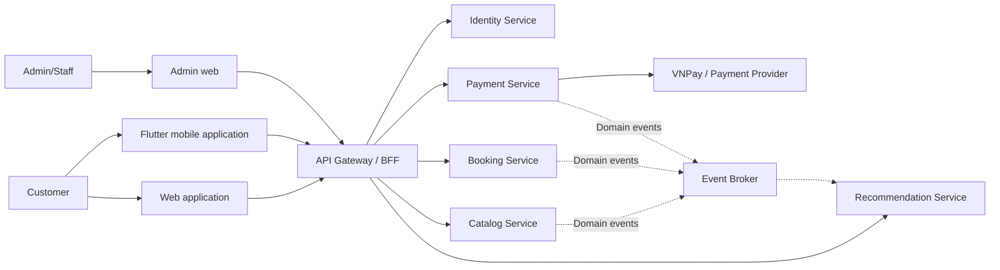
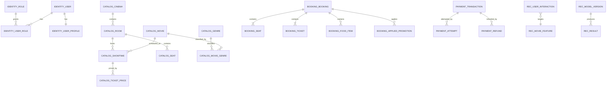
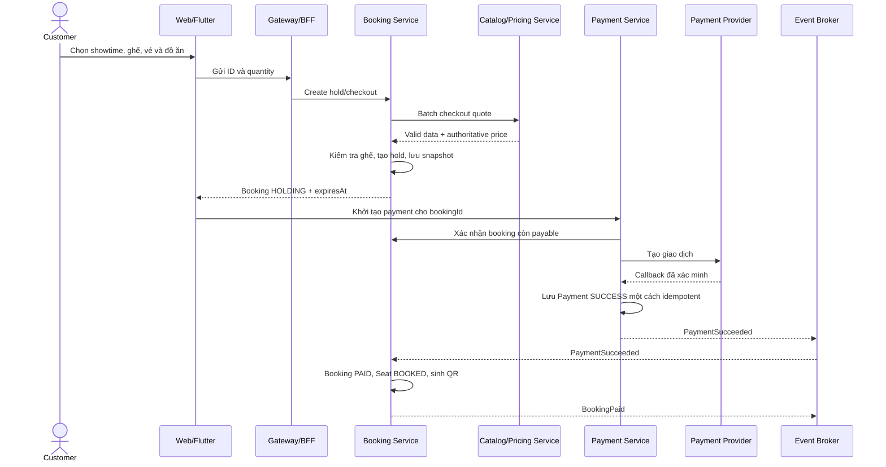
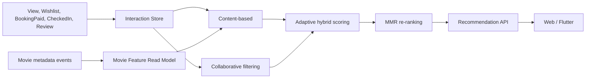

# CinemaAI Microservices - Conceptual Design

## 1. Mục tiêu

Chuyển CinemaAI từ Spring Boot monolith sang các bounded context có quyền sở hữu dữ liệu rõ ràng, trong khi vẫn giữ nguyên các nghiệp vụ cốt lõi: xem phim, chọn suất chiếu, giữ ghế, mua vé/đồ ăn, thanh toán, check-in và gợi ý phim.

Ba nguyên tắc chính:

1. Mỗi service sở hữu dữ liệu của mình; service khác không truy cập trực tiếp database đó.
2. Quan hệ xuyên service được giữ bằng logical ID, không dùng physical foreign key.
3. Booking lưu transaction snapshot để bảo toàn lịch sử và không phải gọi Catalog khi đọc lại vé/hóa đơn.

## 2. System context



Gateway/BFF là điểm vào chung của Web và Flutter. Gateway phụ trách routing, authentication và các concern dùng chung; business rule vẫn nằm trong service sở hữu nghiệp vụ.

## 3. Service ownership

### 3.1 Identity Service

Sở hữu danh tính và quyền truy cập:

- User
- UserProfile
- Role, UserRole
- RefreshToken
- Email/phone verification token
- Password reset token
- StaffProfile và thông tin nhân viên liên quan đến danh tính

Không sở hữu Booking. Booking Service chỉ lưu `userId` và snapshot thông tin khách khi nghiệp vụ hóa đơn/vé yêu cầu.

### 3.2 Catalog Service

Sở hữu thông tin có thể thay đổi theo thời gian:

- Movie, Genre, Actor, MovieGenre, MovieActor
- Cinema, Room, SeatRow, Seat
- Showtime
- TicketPricingRule, TicketCombo
- FoodItem, FoodCombo
- Định nghĩa promotion nếu promotion là một phần của pricing

Catalog là nguồn có thẩm quyền cho trạng thái phim, suất chiếu, ghế vật lý, đồ ăn và giá tại thời điểm checkout.

### 3.3 Booking Service

Sở hữu giao dịch đặt chỗ:

- Booking
- BookingSeat
- BookingTicket
- BookingFoodItem
- FoodOrder độc lập
- Seat hold runtime
- Promotion đã áp dụng vào booking
- QR/pickup entitlement

Booking không sở hữu Movie, Showtime, Seat hoặc FoodItem gốc. Service này lưu logical ID và snapshot cần thiết cho giao dịch.

### 3.4 Payment Service

Sở hữu dòng tiền và kết quả giao dịch:

- Payment
- PaymentAttempt
- Refund
- ProviderTransaction
- CineWallet, WalletTransaction, WithdrawalRequest nếu nhóm giữ tính năng wallet
- Loyalty ledger có thể được giữ trong service này ở giai đoạn đầu

Payment chỉ lưu `bookingId`, `foodOrderId`, `userId` dạng logical reference. Payment không update trực tiếp database Booking.

### 3.5 Recommendation Service

Sở hữu dữ liệu và kết quả gợi ý:

- UserInteraction
- MovieFeatureReadModel
- UserPreferenceProfile
- RecommendationResult/History
- ModelVersion
- ExperimentMetric

Wishlist, watch history, trailer interaction và rating/review là các signal đầu vào. Ở target architecture, Recommendation nhận signal qua API/event hoặc một interaction endpoint; không query trực tiếp database của Catalog hay Booking.

### 3.6 Supporting concerns

Notification và Audit có thể tạm thời là module dùng chung trong giai đoạn migration. Chỉ tách thành service riêng nếu còn thời gian; không cần thêm service chỉ để đạt mục tiêu số lượng.

## 4. Conceptual data model theo service

Đây là conceptual model, không phải physical schema. ID xuyên service không mang ràng buộc foreign key ở database.



## 5. Logical reference và snapshot

### 5.1 Booking

```text
Booking
- bookingId
- userId                         logical reference -> Identity
- showtimeId                     logical reference -> Catalog
- movieId                        logical reference -> Catalog
- bookingCode
- status
- holdExpiresAt
- subtotal
- discountAmount
- totalAmount
- customerNameSnapshot           optional, nếu vé/hóa đơn cần
- customerEmailSnapshot          optional, nếu vé/hóa đơn cần
- movieTitleSnapshot
- showtimeStartSnapshot
- cinemaNameSnapshot
- roomNameSnapshot
```

Thời gian giữ ghế được chốt là **3 phút**. `holdExpiresAt` được tính từ thời điểm lượt giữ ghế được tạo hoặc gia hạn. Khi hết hạn, booking chuyển sang `EXPIRED` và các ghế được giải phóng.

### 5.2 BookingSeat

```text
BookingSeat
- bookingSeatId
- bookingId                      internal foreign key trong Booking DB
- seatId                         logical reference -> Catalog
- seatLabelSnapshot
- seatTypeSnapshot
- unitPriceSnapshot
- runtimeStatus
```

### 5.3 BookingTicket

```text
BookingTicket
- bookingTicketId
- bookingId                      internal foreign key trong Booking DB
- ticketTypeSnapshot
- viewerAge
- quantity
- unitPriceSnapshot
- lineTotal
```

### 5.4 BookingFoodItem

```text
BookingFoodItem
- bookingFoodItemId
- bookingId                      internal foreign key trong Booking DB
- productId                      logical reference -> Catalog
- productType                    FOOD_ITEM | FOOD_COMBO
- productNameSnapshot
- skuSnapshot                    optional
- unitPriceSnapshot
- quantity
- lineTotal
```

`productNameSnapshot` và `unitPriceSnapshot` không được đồng bộ lại khi Catalog thay đổi. Đây là thông tin tại thời điểm mua, giống cách `order_detail` lưu tên và giá sản phẩm.

### 5.5 Payment

```text
Payment
- paymentId
- bookingId hoặc foodOrderId     logical reference -> Booking
- userId                         logical reference -> Identity
- bookingCodeSnapshot
- provider
- amount
- currency
- status
- transactionReference
- paidAt
```

## 6. Quy tắc checkout

Frontend chỉ gửi ID và lựa chọn của người dùng:

```json
{
  "showtimeId": "showtime-id",
  "seatIds": ["seat-id-1", "seat-id-2"],
  "tickets": [
    {"seatId": "seat-id-1", "ticketType": "ADULT", "viewerAge": 24}
  ],
  "foods": [
    {"productId": "food-id", "productType": "FOOD_ITEM", "quantity": 2}
  ]
}
```

Frontend không phải nguồn tin cậy cho tên sản phẩm, đơn giá, giảm giá hoặc tổng tiền.

Booking gọi Catalog/Pricing một lần theo batch:

```text
POST /internal/checkout-quotes
```

Response conceptual:

```json
{
  "quoteId": "quote-id",
  "priceVersion": 15,
  "validUntil": "2026-09-15T19:10:00",
  "showtime": {},
  "seats": [],
  "tickets": [],
  "foods": [],
  "subtotal": 250000,
  "discountAmount": 0,
  "totalAmount": 250000
}
```

Không gọi Catalog riêng từng lần cho từng ghế/đồ ăn vì sẽ tạo N+1 network calls.

## 7. Booking và payment flow



Trong target microservice, Payment không sửa trực tiếp bảng Booking. Consumer phải idempotent vì event có thể được giao lại.

## 8. Domain events

| Producer | Event | Consumer chính | Mục đích |
|---|---|---|---|
| Catalog | `MoviePublished`, `MovieUpdated` | Recommendation | Cập nhật movie feature read model |
| Catalog | `ShowtimeCancelled` | Booking | Hủy/hoàn các booking bị ảnh hưởng |
| Catalog | `FoodPriceChanged` | Read models | Cập nhật thông tin mới; không sửa snapshot cũ |
| Booking | `BookingHeld` | Analytics/Notification | Ghi nhận hold |
| Booking | `BookingPaid` | Recommendation/Loyalty/Notification | Signal mạnh, cộng điểm, gửi vé |
| Booking | `BookingExpired` | Analytics | Ghi nhận hết hold |
| Booking | `BookingCancelled` | Payment/Recommendation | Xử lý nghiệp vụ liên quan |
| Booking | `TicketCheckedIn` | Recommendation | Xác nhận user thực sự đã xem |
| Payment | `PaymentSucceeded` | Booking | Chuyển booking sang PAID |
| Payment | `PaymentFailed` | Booking/Notification | Hiển thị retry/thông báo |
| Payment | `RefundCompleted` | Booking/Loyalty | Chuyển REFUNDED và đảo điểm |
| Interaction API | `MovieViewed`, `WishlistAdded`, `ReviewCreated` | Recommendation | Implicit/explicit feedback |

Event tối thiểu có `eventId`, `eventType`, `version`, `occurredAt`, `aggregateId`, `correlationId` và payload. Event quan trọng được phát bằng Transactional Outbox; consumer deduplicate bằng `eventId`.

## 9. Recommendation conceptual



Điểm implicit feedback khởi đầu để thử nghiệm:

```text
MovieViewed       = 1
WishlistAdded     = 3
BookingPaid       = 5
TicketCheckedIn   = 6
ReviewCreated     = explicit rating hoặc signal bổ sung
```

Hybrid score:

```text
S(u,i) = alpha(u) * S_CF(u,i) + (1 - alpha(u)) * S_CB(u,i)
alpha(u) = min(0.8, n(u) / (n(u) + k))
```

User ít tương tác được ưu tiên content-based; user có nhiều interaction tăng trọng số collaborative filtering. Các trọng số là giả thuyết nghiên cứu, phải đánh giá bằng Precision@K, Recall@K, NDCG@K, MAP@K, Coverage và Diversity.

## 10. State machine cần đồng bộ với Stitch

Booking:

```text
HOLDING -> PENDING_PAYMENT -> PAID -> USED
HOLDING/PENDING_PAYMENT -> CANCELLED | EXPIRED
PAID/USED -> REFUND_REQUESTED -> REFUNDED | REFUND_FAILED
```

Payment:

```text
PENDING -> SUCCESS | FAILED | CANCELLED
SUCCESS -> REFUNDED
```

Seat runtime:

```text
HOLDING | BOOKED | RELEASED | CHECKED_IN
```

Stitch cần tối thiểu các trạng thái: ghế available/selected/holding/booked, hold countdown, payment success/failed, booking expired, refund pending/completed và ticket đã check-in.

## 11. Điểm cần giảng viên xác nhận

1. Loyalty/Wallet sẽ nằm trong Payment Service ở giai đoạn đầu hay tách thành service riêng nếu còn thời gian.
2. Review/Wishlist thuộc Recommendation/Engagement hay giữ trong Catalog trong đợt migration đầu.
3. Target hiện tại là một cinema; conceptual vẫn giữ Cinema để quản lý Room/Seat đúng nghiệp vụ.
