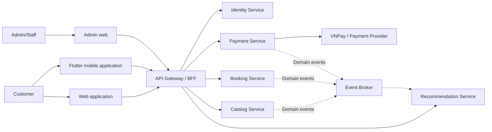
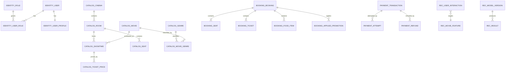
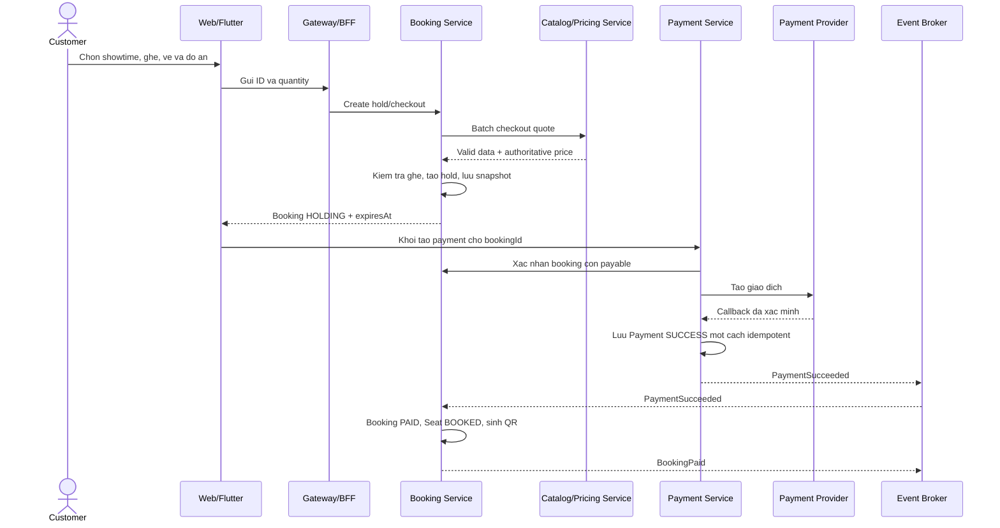
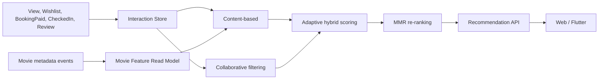

# CinemaAI Microservices - Conceptual Design

## 1. Muc tieu

Chuyen CinemaAI tu Spring Boot monolith sang cac bounded context co quyen so huu du lieu ro rang, trong khi van giu nguyen cac nghiep vu cot loi: xem phim, chon suat chieu, giu ghe, mua ve/do an, thanh toan, check-in va goi y phim.

Ba nguyen tac chinh:

1. Moi service so huu du lieu cua minh; service khac khong truy cap truc tiep database do.
2. Quan he xuyen service duoc giu bang logical ID, khong dung physical foreign key.
3. Booking luu transaction snapshot de bao toan lich su va khong phai goi Catalog khi doc lai ve/hoa don.

## 2. System context



Gateway/BFF la diem vao chung cua Web va Flutter. Gateway phu trach routing, authentication va cac concern dung chung; business rule van nam trong service so huu nghiep vu.

## 3. Service ownership

### 3.1 Identity Service

So huu danh tinh va quyen truy cap:

- User
- UserProfile
- Role, UserRole
- RefreshToken
- Email/phone verification token
- Password reset token
- StaffProfile va thong tin nhan vien lien quan den danh tinh

Khong so huu Booking. Booking Service chi luu `userId` va snapshot thong tin khach khi nghiep vu hoa don/ve yeu cau.

### 3.2 Catalog Service

So huu thong tin co the thay doi theo thoi gian:

- Movie, Genre, Actor, MovieGenre, MovieActor
- Cinema, Room, SeatRow, Seat
- Showtime
- TicketPricingRule, TicketCombo
- FoodItem, FoodCombo
- Dinh nghia promotion neu promotion la mot phan cua pricing

Catalog la nguon co tham quyen cho trang thai phim, suat chieu, ghe vat ly, do an va gia tai thoi diem checkout.

### 3.3 Booking Service

So huu giao dich dat cho:

- Booking
- BookingSeat
- BookingTicket
- BookingFoodItem
- FoodOrder doc lap
- Seat hold runtime
- Promotion da ap dung vao booking
- QR/pickup entitlement

Booking khong so huu Movie, Showtime, Seat hoac FoodItem goc. Service nay luu logical ID va snapshot can thiet cho giao dich.

### 3.4 Payment Service

So huu dong tien va ket qua giao dich:

- Payment
- PaymentAttempt
- Refund
- ProviderTransaction
- CineWallet, WalletTransaction, WithdrawalRequest neu nhom giu tinh nang wallet
- Loyalty ledger co the duoc giu trong service nay o giai doan dau

Payment chi luu `bookingId`, `foodOrderId`, `userId` dang logical reference. Payment khong update truc tiep database Booking.

### 3.5 Recommendation Service

So huu du lieu va ket qua goi y:

- UserInteraction
- MovieFeatureReadModel
- UserPreferenceProfile
- RecommendationResult/History
- ModelVersion
- ExperimentMetric

Wishlist, watch history, trailer interaction va rating/review la cac signal dau vao. O target architecture, Recommendation nhan signal qua API/event hoac mot interaction endpoint; khong query truc tiep database cua Catalog hay Booking.

### 3.6 Supporting concerns

Notification va Audit co the tam thoi la module dung chung trong giai doan migration. Chi tach thanh service rieng neu con thoi gian; khong can them service chi de dat muc tieu so luong.

## 4. Conceptual data model theo service

Day la conceptual model, khong phai physical schema. ID xuyen service khong mang rang buoc foreign key o database.



## 5. Logical reference va snapshot

### 5.1 Booking

```text
Booking
- bookingId
- userId                         logical reference -> Identity
- showtimeId                     logical reference -> Catalog
- movieId                        logical reference -> Catalog
- bookingCode
- status
- holdExpiresAt
- subtotal
- discountAmount
- totalAmount
- customerNameSnapshot           optional, neu ve/hoa don can
- customerEmailSnapshot          optional, neu ve/hoa don can
- movieTitleSnapshot
- showtimeStartSnapshot
- cinemaNameSnapshot
- roomNameSnapshot
```

Thoi gian giu ghe duoc chot la **3 phut**. `holdExpiresAt` duoc tinh tu thoi diem luot giu ghe duoc tao hoac gia han. Khi het han, booking chuyen sang `EXPIRED` va cac ghe duoc giai phong.

### 5.2 BookingSeat

```text
BookingSeat
- bookingSeatId
- bookingId                      internal foreign key trong Booking DB
- seatId                         logical reference -> Catalog
- seatLabelSnapshot
- seatTypeSnapshot
- unitPriceSnapshot
- runtimeStatus
```

### 5.3 BookingTicket

```text
BookingTicket
- bookingTicketId
- bookingId                      internal foreign key trong Booking DB
- ticketTypeSnapshot
- viewerAge
- quantity
- unitPriceSnapshot
- lineTotal
```

### 5.4 BookingFoodItem

```text
BookingFoodItem
- bookingFoodItemId
- bookingId                      internal foreign key trong Booking DB
- productId                      logical reference -> Catalog
- productType                    FOOD_ITEM | FOOD_COMBO
- productNameSnapshot
- skuSnapshot                    optional
- unitPriceSnapshot
- quantity
- lineTotal
```

`productNameSnapshot` va `unitPriceSnapshot` khong duoc dong bo lai khi Catalog thay doi. Day la thong tin tai thoi diem mua, giong cach `order_detail` luu ten va gia san pham.

### 5.5 Payment

```text
Payment
- paymentId
- bookingId hoac foodOrderId     logical reference -> Booking
- userId                         logical reference -> Identity
- bookingCodeSnapshot
- provider
- amount
- currency
- status
- transactionReference
- paidAt
```

## 6. Quy tac checkout

Frontend chi gui ID va lua chon cua nguoi dung:

```json
{
  "showtimeId": "showtime-id",
  "seatIds": ["seat-id-1", "seat-id-2"],
  "tickets": [
    {"seatId": "seat-id-1", "ticketType": "ADULT", "viewerAge": 24}
  ],
  "foods": [
    {"productId": "food-id", "productType": "FOOD_ITEM", "quantity": 2}
  ]
}
```

Frontend khong phai nguon tin cay cho ten san pham, don gia, giam gia hoac tong tien.

Booking goi Catalog/Pricing mot lan theo batch:

```text
POST /internal/checkout-quotes
```

Response conceptual:

```json
{
  "quoteId": "quote-id",
  "priceVersion": 15,
  "validUntil": "2026-09-15T19:10:00",
  "showtime": {},
  "seats": [],
  "tickets": [],
  "foods": [],
  "subtotal": 250000,
  "discountAmount": 0,
  "totalAmount": 250000
}
```

Khong goi Catalog rieng tung lan cho tung ghe/do an vi se tao N+1 network calls.

## 7. Booking va payment flow



Trong target microservice, Payment khong sua truc tiep bang Booking. Consumer phai idempotent vi event co the duoc giao lai.

## 8. Domain events

| Producer | Event | Consumer chinh | Muc dich |
|---|---|---|---|
| Catalog | `MoviePublished`, `MovieUpdated` | Recommendation | Cap nhat movie feature read model |
| Catalog | `ShowtimeCancelled` | Booking | Huy/hoan cac booking bi anh huong |
| Catalog | `FoodPriceChanged` | Read models | Cap nhat thong tin moi; khong sua snapshot cu |
| Booking | `BookingHeld` | Analytics/Notification | Ghi nhan hold |
| Booking | `BookingPaid` | Recommendation/Loyalty/Notification | Signal manh, cong diem, gui ve |
| Booking | `BookingExpired` | Analytics | Ghi nhan het hold |
| Booking | `BookingCancelled` | Payment/Recommendation | Xu ly nghiep vu lien quan |
| Booking | `TicketCheckedIn` | Recommendation | Xac nhan user thuc su da xem |
| Payment | `PaymentSucceeded` | Booking | Chuyen booking sang PAID |
| Payment | `PaymentFailed` | Booking/Notification | Hien thi retry/thong bao |
| Payment | `RefundCompleted` | Booking/Loyalty | Chuyen REFUNDED va dao diem |
| Interaction API | `MovieViewed`, `WishlistAdded`, `ReviewCreated` | Recommendation | Implicit/explicit feedback |

Event toi thieu co `eventId`, `eventType`, `version`, `occurredAt`, `aggregateId`, `correlationId` va payload. Event quan trong duoc phat bang Transactional Outbox; consumer deduplicate bang `eventId`.

## 9. Recommendation conceptual



Diem implicit feedback khoi dau de thu nghiem:

```text
MovieViewed       = 1
WishlistAdded     = 3
BookingPaid       = 5
TicketCheckedIn   = 6
ReviewCreated     = explicit rating hoac signal bo sung
```

Hybrid score:

```text
S(u,i) = alpha(u) * S_CF(u,i) + (1 - alpha(u)) * S_CB(u,i)
alpha(u) = min(0.8, n(u) / (n(u) + k))
```

User it tuong tac duoc uu tien content-based; user co nhieu interaction tang trong so collaborative filtering. Cac trong so la gia thuyet nghien cuu, phai danh gia bang Precision@K, Recall@K, NDCG@K, MAP@K, Coverage va Diversity.

## 10. State machine can dong bo voi Stitch

Booking:

```text
HOLDING -> PENDING_PAYMENT -> PAID -> USED
HOLDING/PENDING_PAYMENT -> CANCELLED | EXPIRED
PAID/USED -> REFUND_REQUESTED -> REFUNDED | REFUND_FAILED
```

Payment:

```text
PENDING -> SUCCESS | FAILED | CANCELLED
SUCCESS -> REFUNDED
```

Seat runtime:

```text
HOLDING | BOOKED | RELEASED | CHECKED_IN
```

Stitch can toi thieu cac trang thai: ghe available/selected/holding/booked, hold countdown, payment success/failed, booking expired, refund pending/completed va ticket da check-in.

## 11. Diem can giang vien xac nhan

1. Loyalty/Wallet se nam trong Payment Service o giai doan dau hay tach thanh service rieng neu con thoi gian.
2. Review/Wishlist thuoc Recommendation/Engagement hay giu trong Catalog trong dot migration dau.
3. Target hien tai la mot cinema; conceptual van giu Cinema de quan ly Room/Seat dung nghiep vu.
