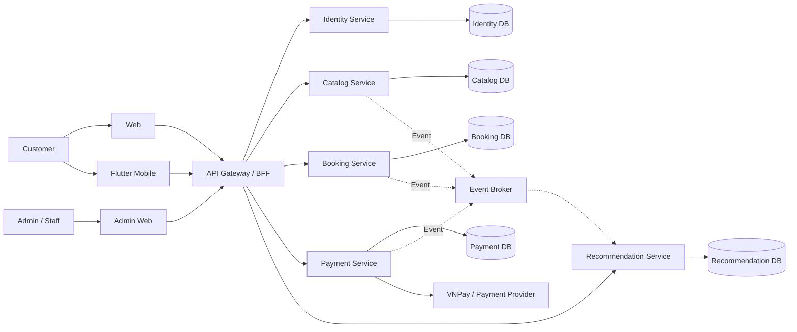
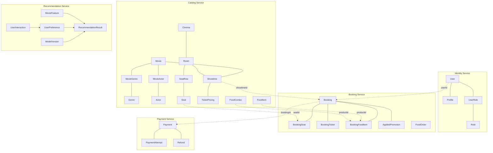
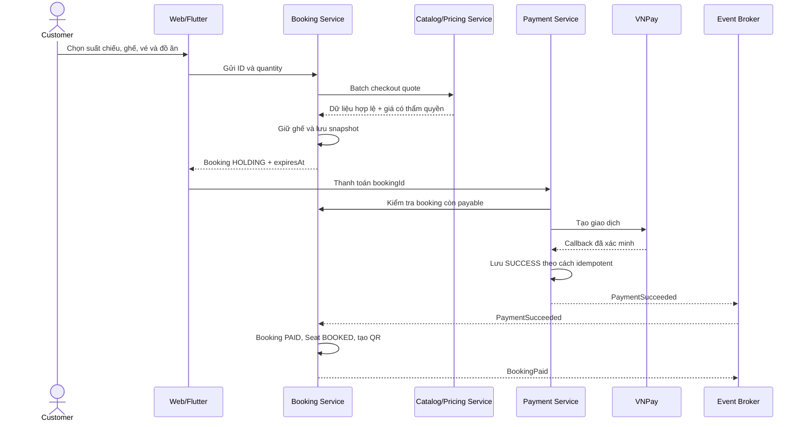
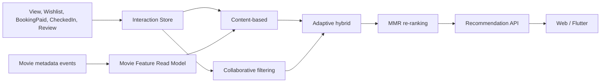

# CinemaAI — Microservices Conceptual Design

## 1. Mục tiêu

CinemaAI hiện là một Spring Boot monolith có AI Service riêng. Kiến trúc mục tiêu chia hệ thống theo nghiệp vụ nhưng vẫn giữ nguyên luồng chính:

```text
Xem phim → Chọn suất chiếu → Giữ ghế → Chọn vé/đồ ăn
→ Thanh toán → Nhận QR → Check-in → Ghi nhận dữ liệu recommendation
```

Ba nguyên tắc thiết kế:

1. Mỗi service sở hữu dữ liệu của mình; service khác không truy cập trực tiếp database đó.
2. Quan hệ xuyên service dùng logical ID, không tạo foreign key vật lý.
3. Booking lưu snapshot thông tin tại thời điểm mua để bảo toàn lịch sử và giảm lời gọi sang Catalog.

## 2. Kiến trúc tổng thể



Gateway/BFF là điểm vào chung của Web và Flutter. Business rule vẫn thuộc service chuyên trách, không đặt trong Gateway.

## 3. Service ownership

| Service | Dữ liệu sở hữu chính | Không sở hữu |
|---|---|---|
| Identity | User, Profile, Role, token, staff identity | Booking, Payment |
| Catalog | Movie, Genre, Actor, Cinema, Room, Seat, Showtime, TicketPricing, FoodItem, FoodCombo | Booking của khách |
| Booking | Booking, BookingSeat, BookingTicket, BookingFoodItem, FoodOrder, seat hold, QR | Movie/Seat/Food gốc |
| Payment | Payment, PaymentAttempt, Refund, provider transaction; có thể giữ Wallet/Loyalty ở giai đoạn đầu | Không được sửa trực tiếp Booking DB |
| Recommendation | UserInteraction, MovieFeatureReadModel, UserPreference, RecommendationResult, ModelVersion | Không đọc trực tiếp DB của Catalog/Booking |

Notification và Audit có thể giữ ở dạng supporting module trong giai đoạn đầu. Không cần tách thêm service chỉ để tăng số lượng microservice.

## 4. Conceptual model



Các đường nét đứt là logical reference giữa service. Chúng không phải foreign key trong database.

## 5. Snapshot Pattern

Booking không sao chép toàn bộ Catalog. Nó chỉ lưu những thông tin cần cho vé, hóa đơn, lịch sử và hoàn tiền.

### Booking

```text
bookingId
userId                         logical reference → Identity
showtimeId                     logical reference → Catalog
movieId                        logical reference → Catalog
bookingCode
status
holdExpiresAt
subtotal, discountAmount, totalAmount
movieTitleSnapshot
showtimeStartSnapshot
cinemaNameSnapshot
roomNameSnapshot
customerNameSnapshot           nếu vé/hóa đơn cần
customerEmailSnapshot          nếu vé/hóa đơn cần
```

Thời gian giữ ghế được chốt là **3 phút**. `holdExpiresAt` được tính từ thời điểm lượt giữ ghế được tạo hoặc gia hạn. Khi hết hạn, booking chuyển sang `EXPIRED` và các ghế được giải phóng.

### BookingSeat

```text
bookingSeatId
bookingId                      internal FK trong Booking DB
seatId                         logical reference → Catalog
seatLabelSnapshot
seatTypeSnapshot
unitPriceSnapshot
runtimeStatus
```

### BookingFoodItem

```text
bookingFoodItemId
bookingId                      internal FK trong Booking DB
productId                      logical reference → Catalog
productType                    FOOD_ITEM | FOOD_COMBO
productNameSnapshot
unitPriceSnapshot
quantity
lineTotal
```

Ví dụ giá combo lúc khách đặt là 100.000 đồng. Sau đó Catalog đổi thành 120.000 đồng thì lịch sử booking vẫn hiển thị 100.000 đồng. `productId` giữ quan hệ logic; `productNameSnapshot` và `unitPriceSnapshot` giữ sự thật của giao dịch.

## 6. Checkout

Web/Flutter chỉ gửi lựa chọn của người dùng:

```json
{
  "showtimeId": "showtime-id",
  "seatIds": ["seat-id-1", "seat-id-2"],
  "tickets": [
    {"seatId": "seat-id-1", "ticketType": "ADULT", "viewerAge": 24}
  ],
  "foods": [
    {"productId": "food-id", "productType": "FOOD_ITEM", "quantity": 2}
  ]
}
```

Frontend không phải nguồn tin cậy cho tên sản phẩm, đơn giá, giảm giá hoặc tổng tiền. Booking gọi Catalog/Pricing một lần theo batch:

```text
POST /internal/checkout-quotes
```

Catalog trả về dữ liệu hợp lệ, giá có thẩm quyền, `quoteId`, `priceVersion` và `validUntil`. Booking kiểm tra ghế, tính tổng và lưu snapshot. Không gọi Catalog riêng từng ghế hoặc từng món vì sẽ tạo N+1 network calls.

## 7. Luồng Booking–Payment



Payment không update trực tiếp bảng Booking. Event quan trọng nên được phát bằng Transactional Outbox; consumer dùng `eventId` để không xử lý lặp.

## 8. Domain events chính

| Producer | Event | Consumer/Mục đích |
|---|---|---|
| Catalog | `MoviePublished`, `MovieUpdated` | Recommendation cập nhật movie feature |
| Catalog | `ShowtimeCancelled` | Booking xử lý booking bị ảnh hưởng |
| Booking | `BookingHeld`, `BookingExpired` | Notification/analytics |
| Booking | `BookingPaid` | Recommendation, loyalty, notification |
| Booking | `BookingCancelled` | Payment/recommendation |
| Booking | `TicketCheckedIn` | Recommendation xác nhận đã xem |
| Payment | `PaymentSucceeded`, `PaymentFailed` | Booking và notification |
| Payment | `RefundCompleted` | Booking và loyalty |
| Interaction | `MovieViewed`, `WishlistAdded`, `ReviewCreated` | Recommendation |

## 9. Recommendation conceptual



Công thức dự kiến:

```text
S(u,i) = alpha(u) × S_CF(u,i) + (1 - alpha(u)) × S_CB(u,i)
alpha(u) = min(0.8, n(u) / (n(u) + k))
```

Người dùng ít tương tác được ưu tiên content-based; khi có nhiều interaction thì tăng trọng số collaborative filtering. Đây là giả thuyết để thực nghiệm, chưa phải kết luận. Nhóm sẽ đánh giá bằng Precision@K, Recall@K, NDCG@K, MAP@K, Coverage và Diversity.

## 10. Trạng thái phải đồng bộ với Stitch

```text
Booking:
HOLDING → PENDING_PAYMENT → PAID → USED
HOLDING/PENDING_PAYMENT → CANCELLED | EXPIRED
PAID/USED → REFUND_REQUESTED → REFUNDED | REFUND_FAILED

Payment:
PENDING → SUCCESS | FAILED | CANCELLED
SUCCESS → REFUNDED

Seat runtime:
HOLDING | BOOKED | RELEASED | CHECKED_IN
```

Stitch cần thể hiện ghế available/selected/holding/booked, countdown giữ ghế, payment success/failed, booking expired, refund và QR ticket sau khi thanh toán.

## 11. Điểm nhóm cần chốt

1. Loyalty/Wallet nằm trong Payment Service ở giai đoạn đầu hay tách sau.
2. Review/Wishlist thuộc Recommendation/Engagement ngay từ đầu hay được chuyển dần trong quá trình migration.
3. Scope hiện tại là một cinema; vẫn giữ Cinema trong model để quản lý Room và Seat đúng nghiệp vụ.
